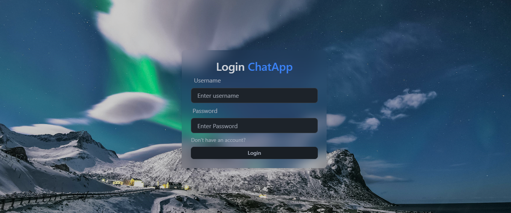

# **Chat Application**

A real-time chat platform built using the MERN (MongoDB, Express.js, React.js, and Node.js) stack, supporting individual and group chats with secure user authentication and profile management.

---

## **Features**

- **User Authentication:**  
  Secure user registration and login with password encryption using bcrypt and session management with JSON Web Tokens (JWT).

- **Real-time Messaging:**  
  Instant messaging for personal and group chats using Socket.IO for bi-directional communication.

- **Group Chats:**  
  Ability to create and join group chats, with admin privileges for managing group members.

- **Profile Management:**  
  Upload and display profile pictures to personalize user accounts.

---

## **Technologies Used**

### **Frontend:**
- **React.js:** Component-based architecture for building a dynamic and responsive user interface.
- **Tailwind CSS:** Pre-built UI components for enhanced design and responsiveness.

### **Backend:**
- **Node.js:** Backend runtime environment for building server-side logic.
- **Express.js:** Framework for API development and middleware integration.
- **Bcrypt.js:** library used for password hashing
- **JWT:** For User Authentication

### **Database:**
- **MongoDB:** Document-oriented database for storing user information, messages, and chat groups.

### **Real-time Communication:**
- **Socket.IO:** Enables real-time messaging by maintaining persistent WebSocket connections.

---

## **Setup and Installation**

Follow these steps to run the application locally:

### **Prerequisites:**
1. **Node.js** (latest stable version)
2. **MongoDB** (local instance or cloud database, e.g., MongoDB Atlas)
3. A package manager: **npm** or **yarn**

### **Steps:**
1. **Clone the Repository:**  
   ```bash
   git clone https://github.com/Rupali-Jaiswal/Chat_Application.git
   cd Chat_Application

 ---  
## **ScreenShots**

.png)



.png)

.png)


